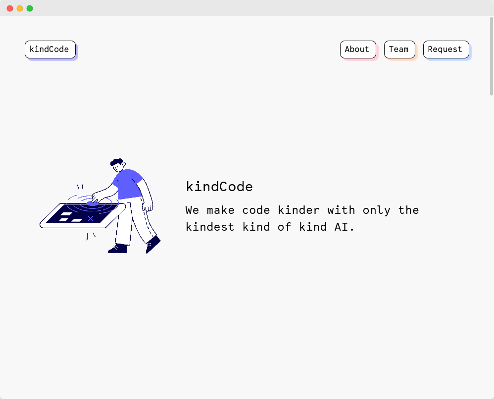
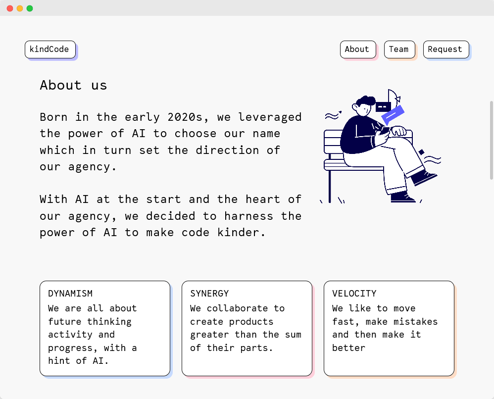
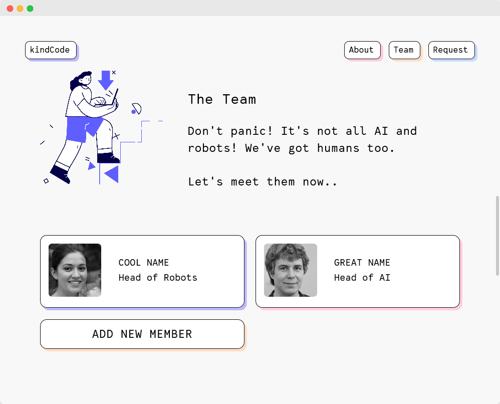
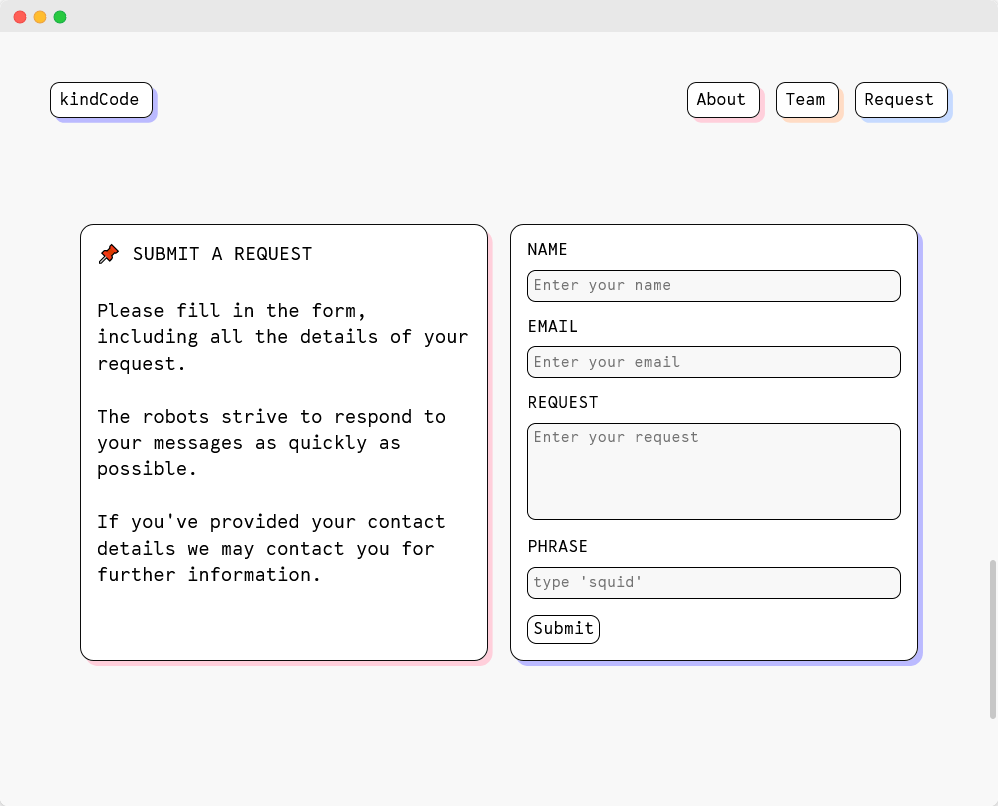
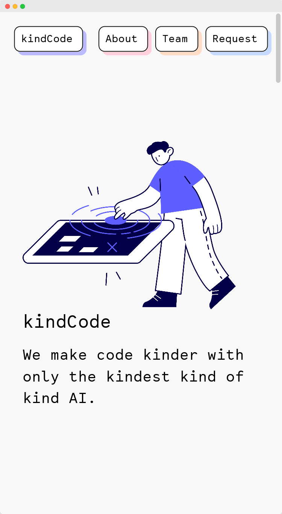
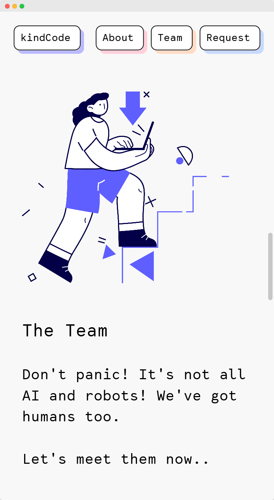
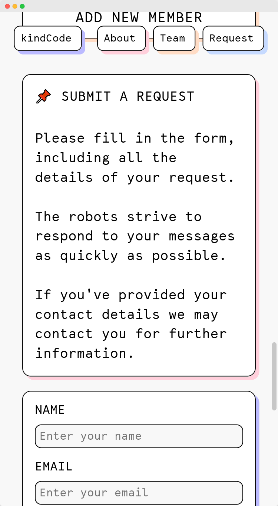

### kindCode Agency Site

"We make code kinder with only the kindest kind of kind AI."

kindCode is an imaginary agency designed and developed by [@lopezelpesado](https://github.com/lopezelpesado) & [@cemalokten](https://github.com/cemalokten)

The font used throughout the site is 'Lab Mono' and is covered by the SIL Open Font License.

### 📚 What we learnt
- How to use GIT `branches`, `issues`, `projects` and `pull requests`
- How to use `<template>` elements along with `.cloneNode(true)`
- A better understanding of CSS `grid` and `flexbox`
- Using JS to `smoothscroll` to elements
- Creating animated CSS buttons
- How to work asynchronously on a project together! 

### 🦺 Testing
- Works on latest version of Firefox, Chrome and Edge
- Works on mobile

### 👀 Screenshots

#### Desktop

#### Mobile

